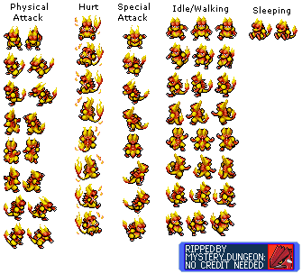

# Contributing

We need you for sprite naming !

The folder app/assets/sprites contains sprites informations about each pokemon.

To display a pokemon, we must have: 

 - Sprites about him. In general, ressources files that we found contains sprites for moving, sleeping, hurt, special attack  and attack.
 - a JSON format to indicate the engine where to find the sprite.
 
 We choose to have one tileset per pokemon. The tileset is an JSON object with the format "JSON TP Array"
 
For example, you will in the folder app/assets/sprites/1:

 - a .png picture that contain all sprites of Bulbasaur (cause his pokedex number is 1).
 - a JSON object that contain informations that will transmit to the game engine, to tell him where are the different sprites.                                                                                                                                       
 Ressources sprites have already been riped on [spriters-resource.com](https://www.spriters-resource.com/ds_dsi/pokemonmysterydungeonexplorersoftimedarkness/).
 
A ripe sprite sheet looks like that:

Unfortunately, the ripe sprite sheet available on spriter-resource can not be used directly. So we need to do some preprocessing befpre using it.

# Contributing by doing Tileset standardisation

Choose a pokemon that has not already his spritesheet inside a folder in aapp/assets/sprites.

For example, Magmar.

Click.
 Then, rename the pokemon sprite that have a "spriteXXX" name following this pattern:

 a_b_c_d

  - Replace a with the pokedex number of the pokemon. For example, charmander value will be "4"
  - Replace b with the number:
    - 0 for a movement sprite
    - 1 for a physical attack
    - 2 for a special attack
    - 3 for a hurt
    - 4 for a sleep
  - Replace c with the number:
    - 0 for down
    - 1 for left down
    - 2 for left
    - 3 for left up
    - 4 for up
  - Replace d with the sprite number. For example, there is three sprites moving left, so their number will be 0-1-2. If only one sprite fit the category, the number will be zero

Cause im nice, i help you to your journey with magmar's sprites:

Save all your changes in JSON-TP-Array, on file sprites.json

Once you done, create a damn good pull request with all of your juicy changes.
