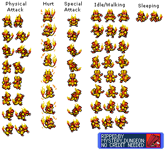

# MysteryDungeonOnline

# If you want to help, cause obviously no ones cares a half of a Spinarak

  - Go to https://www.leshylabs.com/apps/sstool/
  - drag and drop assets/sprites.png
  - drag and drop assets/sprites.json
 
 Then, rename the pokemon sprite that have a "spriteXXX" name following this pattern:
 
 a_b_c_d
 
  - Replace a with the pokedex number of the pokemon. For example, charmander value will be "4"
  - Replace b with the number:
    - 0 for a movement sprite
    - 1 for a physical attack
    - 2 for a special attack
    - 3 for a hurt
    - 4 for a sleep
  - Replace c with the number:
    - 0 for down
    - 1 for left down
    - 2 for left
    - 3 for left up
    - 4 for up
  - Replace d with the sprite number. For example, there is three sprites moving left, so their number will be 0-1-2. If only one sprite fit the category, the number will be zero

Cause im nice, i help you to your journey with magmar's sprites:

Save all your changes in JSON-TP-Array, on file sprites.json

Once you done, create a damn good pull request with all of your juicy changes.
