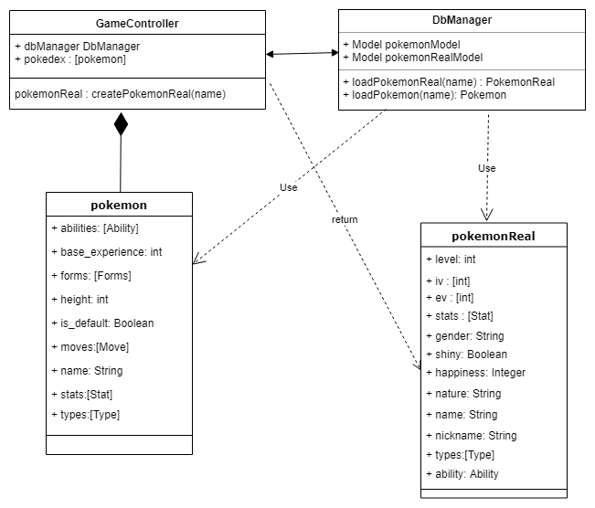
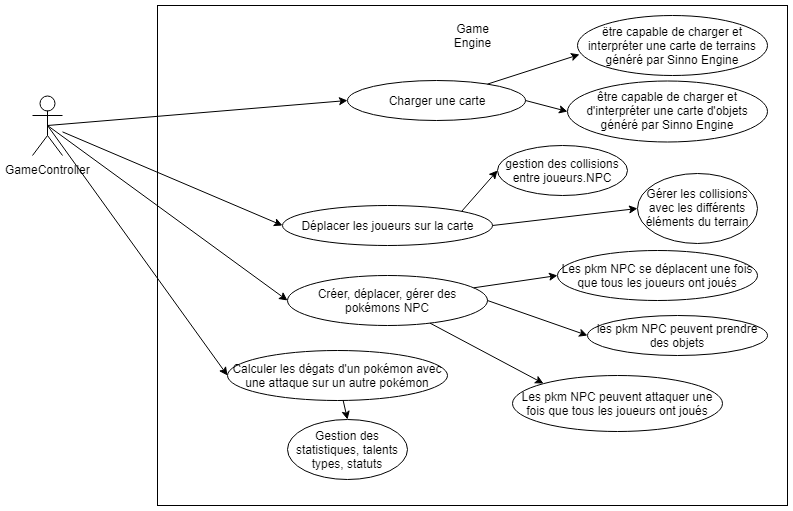
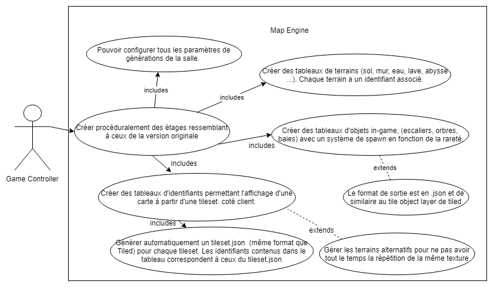

# Documentation

## UML

### Class Diagram

### Use case diagram

## Test map generation

At root, enter :

The generation engine has 3 outputs:

1) the array of type tiles, defining the different terrains by ids

    - 0: ground, all pokemons can walk on it
    - 1: wall, no pokemons except ghost type can walk on it
    - 2: water, only pokemon with water, ghost, fly, levitate ability
    - 3: lava, only pokemon with fire, ghost, fly, levitate ability
    - 4: Abyss, only pokemon with fly and ghost and levitate ability

The generation is highly configurable with all following parameters:

{un exemple du json bien détaillé avec tous les paramètres}

2) the "picture" array, which will be displayed to the client. Directly related to the type tiles array, this array interpret the different ids of the given tileset. And then, compute a representation of the type tiles array. It differs from the type tile cause it makes transitions between all kind of terrains.

A tileset.json needs to be specified for each tileset, containing the following data:
    
    - description of each group of 3 columns : ground, ground_alternative_1, ground_alternative_xxx, wall,water,...
    - ...

3) the Tile Object array, that generate all objects on the map. This array contains objects with different rarity. It although contains the spawn position of players, and the stair leading to the next stage. The output format is the same as the Tiled one, maybe.

## Useful ressources

+ Architecture of a Node.js multiplayer game on [Medium](https://medium.com/@MichalMecinski/architecture-of-a-node-js-multiplayer-game-a9365356cb9)

+ Agar.io clone architecture on [Github](https://github.com/huytd/agar.io-clone/wiki/Game-Architecture)

+ Mozilla's BrowserQuest game on [Github](https://github.com/mozilla/BrowserQuest)

------

Comparison of Socket.io & WebSocket modules:
https://stackoverflow.com/questions/10112178/differences-between-socket-io-and-websockets
